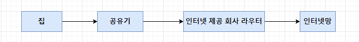
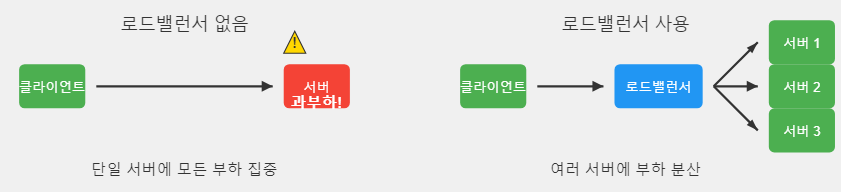
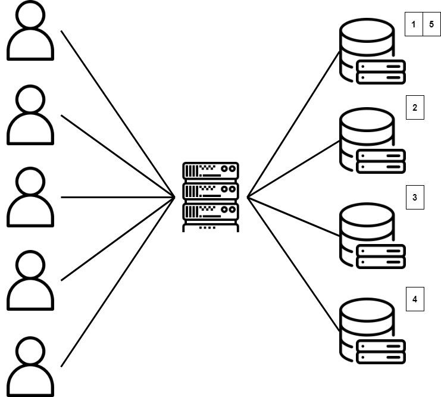
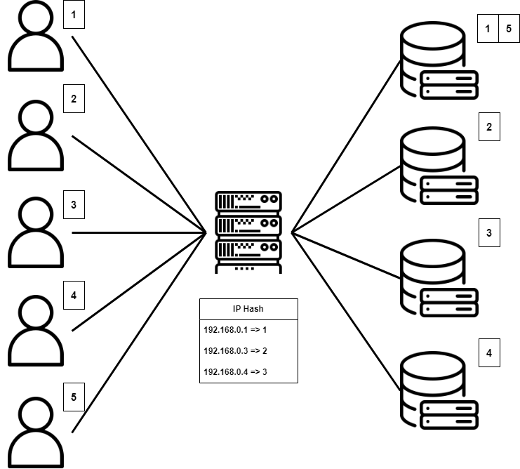
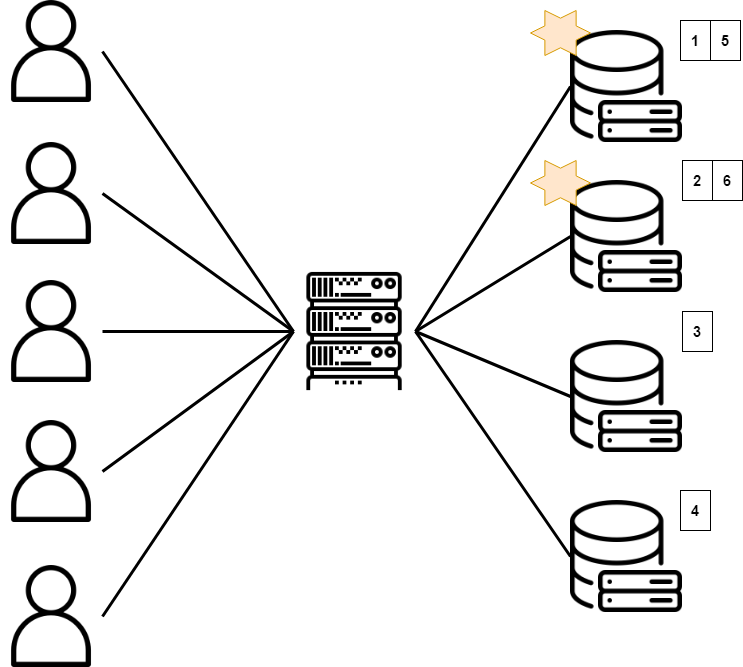

# L 레밸 스위치, 로드밸런서

## 개요
L4 레벨 스위치는 계층 4단계인 전송 계층에서 동작하며, 이를 통해 로드벨런싱이 가능하다.
L7 레벨 스위치는 계층 7단계인 응용 계층에서 동작하며, 이를 통해 로드벨런싱이 가능하다.

L4 레벨은 TCP / UDP의 헤더를 보며 우선 순위 및 다른 컴퓨터에게 전달하여 로드벨런싱이 가능하다.
L7 레벨은 모든 데이터를 확인한 후, HTTP의 URL, 쿠키, 파일 명, POST 내용 등을 보고 더욱 상세하게 로드벨런싱이 가능하다.

## 배경(다른 장치간 비교)

**스위치**: 네트워크 장치를 연결하고 데이터 패킷을 효율적으로 전달하는 네트워크 장비
1. MAC 주소 학습: 스위치는 각 포트에 연결된 장치의 MAC 주소를 학습, MAC 테이블을 유지함. 
2. 패킷 포워딩: 패킷의 목적지 MAC 주소를 확인하고, 해당 주소가 연결된 포트로만 패킷을 전송

**라우터**: LAN과 LAN을 연결하며, 추가로 데이터 전송의 최적 경로를 선택하는 기능 추가.
1. 서로다른 LAN 또는 LAN과 WAN을 연결하는 기능.
2. L3에서 동작(네트워크)
3. 네트워크 보안 기능(방화벽), NAT(사설 IP), DHCP 기능 제공


**게이트웨이**: 게이트웨이는 프로토콜 구조가 다른 네트워크를 연결하는 장치
1. LAN에서 다른 네트워크에 데이터를 보내거나, 다른 네트워크에서 데이터를 받는 출입구 역할.
2. L3 스위치 이상의 장비
* 게이트웨이용 전용 장비도 있고, 일반적으로는 공유기가 라우터 및 게이트웨이 등 다용도를 겸함

<br/>이 사진에서 공유기와 인터넷 제공 회사 라우터가 게이트웨이에 해당하며, 패킷이 목적지에 도달하기 위해서는 수많은 게이트웨이를 지나가야한다.

## L 레밸 스위치

### 1. L2 스위치 (데이터 링크 계층):

1. MAC 주소를 기반으로 프레임을 전송
2. VLAN 기능 지원
3. 동일 네트워크 내에서 작동


### 2. L3 스위치 (네트워크 계층):

1. IP 주소를 기반으로 패킷을 라우팅
2. 라우팅 기능 내장
3. VLAN 간 통신 가능
4. 서로 다른 네트워크 간 통신 가능


### 3. L4 스위치 (전송 계층):

1. TCP/UDP 포트 정보를 사용하여 트래픽 분배
2. 로드 밸런싱 기능 제공
3. 간단한 방화벽 기능 제공

### 4. L7 스위치 (응용 계층):

1. HTTP, FTP, SMTP 등 애플리케이션 레벨의 데이터를 분석하여 트래픽 처리
2. URL, 쿠키, 페이로드 내용 기반 트래픽 처리
콘텐츠 기반 라우팅 가능


## 로드밸런싱

네트워크 트래픽, 애플리케이션 요청을 여러 서버나 리소스에 분산하는 프로세스
1. 서비스의 가용성과 안정성 향상
2. 응답시간 최소화
3. 리소스 활용 최적화
4. 확장성 제공
- - -


서버는 수직적으로 향상시키는 것보다 수평적으로 향상시키는 것이 더 효율적이고 편리함. 그러므로 로드 밸런싱을 사용하여 서버를 효율적으로 다룰 수 있음.

## 알고리즘

1. 라운드 로빈

<br/>라운드로빈은 각각 서버에 순서대로 할당하는 방식이며, 클라이언트의 요청을 분배하여 사용함
<br/>장점: 구현이 간단하고, 서버 비중을 균등하게 사용
<br/>단점: 서버의 처리 능력 차이를 고려하지 않음.


2. IP_Hash

<br/>IP를 넣어 나온 hash 값을 토대로 서버에 할당하는 방식
<br/>장점: 동일 클라이언트는 같은 서버로 전달되어 세션 일관성 유지
<br/>단점: 특정 IP의 트래픽이 많으면 불균형 발생 가능.

3. 가중치 기반 라운드 로빈

<br/>각 서버에 가중치를 부여하여 높은 가중치의 서버에 더 많은 요청 할당
<br/>장점: 서버의 처리 능력 차이를 고려할 수 있음
<br/>단점: 적절한 가중치 설정이 필요하며, 동적 환경 변화에 즉각 대응 어려움


## L4, L7의 비교 포인트
### 처리 깊이

L4: 패킷 헤더만 검사
L7: 패킷 내용까지 검사

### 성능

L4: 높은 처리량, 낮은 지연시간 (패킷 페이로드까지 접근하지 않고, 4계층 이하의 정보로 처리)
L7: 상대적으로 낮은 처리량, 높은 지연시간

### 유연성

L4: 제한적인 트래픽 제어
L7: 매우 세밀한 트래픽 제어 가능(패킷 페이로드까지 접근하여 상세하고 세밀한 로드 밸런싱 가능)

### 보안

L4: 기본적인 네트워크 레벨 보안
L7: 애플리케이션 레벨의 고급 보안 기능

### 비용

L4: 상대적으로 저렴
L7: 고가의 장비 및 라이선스 비용

### 적합한 사용 사례

L4: 대용량 트래픽 처리, 단순한 로드밸런싱 요구
L7: 복잡한 애플리케이션 환경, 고급 보안 요구사항

## 질문

1. 각 스위치 별 차이점은?

2. L4 로드 밸런싱과 L7 로드벨런싱의 차이점은?

3. 서버의 처리 능력을 높이는 방법에는 수직적, 수평적 방법이 존재하는데 
수평적 방법을 주로 사용하며, 로드 밸런싱을 이용한 수평적 방법을 사용한다.

	
	왜 수직적인 방법을 잘 사용하지 않고 수평적 방법을 사용하는지 둘 사이를 비교하시오
	```
	수직적: 서버 한대에 메모리 및 CPU를 여러개 붙여 엄청 똑똑한 컴퓨터 서버 한대를 사용
	수평적: 여러개의 컴퓨터를 서버로 병렬로 연결해서 사용.