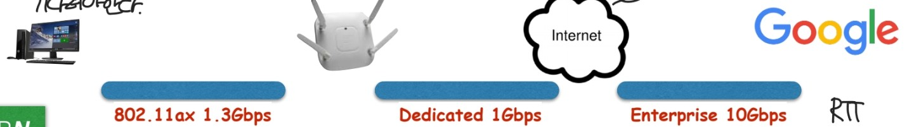
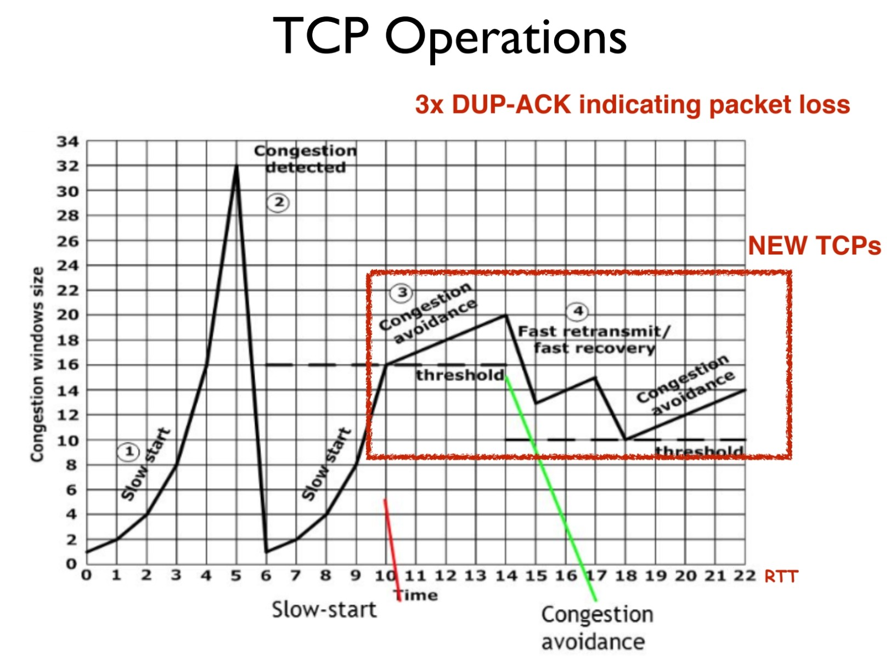
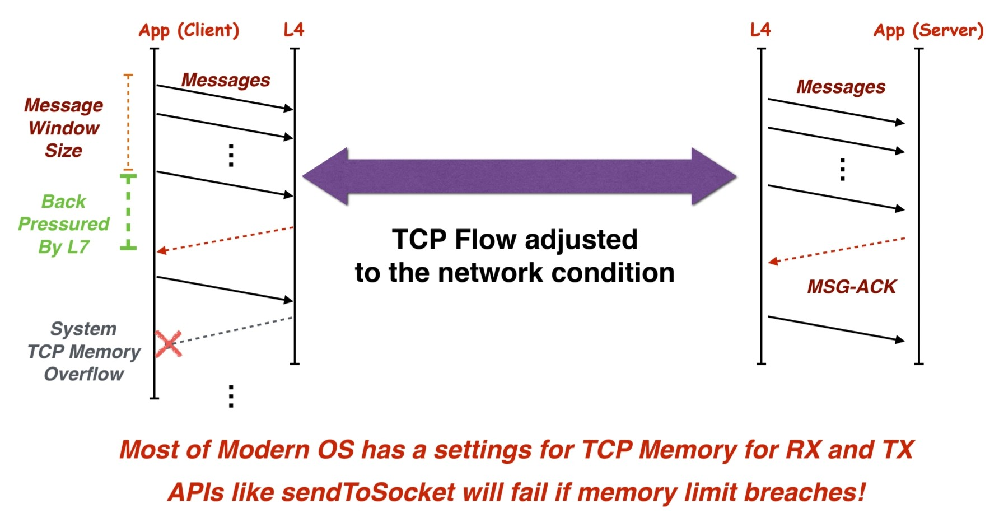

# 대역폭

## 개요

### 대역폭(bandwidth): 데이터의 최대 전송 속도

* 대역폭을 이해하기 위해선 다음의 상황을 알아야한다.
1. RTT: 왕복시간 => 송신지에서 목적지까지 패킷이 왕복하는데 걸리는 시간이다.
   => 수 많은 홉과 라우터를 거치면서 목적지를 도달하기 때문에 빛의 속도로 패킷이 움직여도 거리 및 네트워크 환경에 따라 시간이 걸리게 된다.
2. Long Fat Network : 딜레이도 길고, bandwidth도 큰 네트워크

    => 2의 큰 대역폭을 모두 활용하면 좋겠지만, RTT가 진행되는 동안 대역폭은
    지나가는 구간의 가장 작은 Bandwidth가 기준이 된다. 

사진은 대역폭이 10Gbps까지 넓은 기업 회선이 있지만, 이를 전부 활용하지 못한다.
가장 작은 대역폭이 1Gbps기 때문에, 이를 통과하면 대역폭이 1Gbps가 된다.

3. 재전송: 재전송이 발생할 경우 시간은 더 오래걸린다. 패킷이 TTL이 지나 삭제되거나,
패킷 정보에 에러가 발생하거나(전파 오류), 잘못된 패킷을 입력받아 재전송을 요청할 경우 발생한다. 

4. 대역폭 지연 곱(Delay Bandwidth Products)
선로의 최대 처리량을 이야기하며, 주어진 시간에 최대로 선로에 있을 수 있는 데이터량을 말한다. => 이 공식은 Tcp windows size를 계산할 수 있다.
DBP = bandwidth * RTT 

5. TCP: 신뢰성 있는 통신으로, 패킷마다 번호를 붙여 Receiver은 ACK을 보내 어디까지 받았는 지 응답해준다.

6. TCP: stop & wait: 하나의 패킷을 보내고, Ack이 올때까지 기다리는 방식이며 비효율적

7. TCP: windows: windows만큼의 패킷을 보내고, 수신자는 받은 데이터에 대해 ACK를 보낸다.
송신자는 ACK를 받으면 윈도우를 슬라이딩하여 다음 데이터를 전송한다.

8. Congestion Detected: 혼잡 감지 방법은 여러가지로 감지할 수 있다.
    * 패킷 손실: 타임 아웃, 중복 ACK
    * RTT가 급격하게 증가할 경우

9. Max Windows Size : DBP(4번) * 2가 최대 값이며, 이는 네트워크가 가지는 버퍼를 모두 채우는 것 까지 고려하여 계산한다. 이 경우 delay는 더 걸릴 수 있지만, through put은 최대로 달성한다.
- - -
결국, 패킷이 지나가는 공간은 혼자 쓰는 공간이 아닌 수 많은 패킷이 지나가는 곳이므로, 혼잡도를 항상 생각해야한다. 패킷을 많이 보내 혼잡해져 패킷 재 전송을 하는 것보다는 패킷을 적게 보내는게 더 효율적이기 때문에 Flow Control을 통해 전송 속도를 관리하게 된다.

## 동작

다음의 사진을 보자, 세로축은 windows size이며, 가로축은 시간이다.

windows size가 시간에 따라 지수적으로 상승하다가, 6초에서 최소로 떨어지는걸 볼 수 있다.
이는 **Congestion Detected**를 감지했기 때문이며 혼잡한 경우에 패킷을 많이 보내는 경우 어짜피 다시 재전송 될 것이 뻔하기 때문에 최소한으로 줄여서 혼잡도를 확인한다.

windows size가 32에서 혼잡함을 감지했기 때문에, 이 절반인 16까지는 지수적으로 증가하다가

혼잡도를 피하기 위한 선형적 증가를 택해 천천히 windows가 증가한다.

여기에서 다시 혼잡함을 감지한 경우, 이제는 혼잡함의 범위를 특정할 수 있기 때문에,

Fast recovery 및 Fast retransmit을 통해 빠르게 회복하여 구간을 반복하게 된다.

(혼잡 감지시 절반으로, 절반에서 이제 시작해서 선형으로..)

여기서 최대 Windows size를 구해야하는 이유가 있다. 

실제와 Max size를 비교하여 현재 네트워크가 얼마나 혼잡한지 알 수 있으며,

사진에서는 0에서 시작했지만, 초기 windows size를 설정할 수 있으며,

시스템이 처리할 수 있는 최대 데이터량을 알 수 있어 버퍼 오버플로우를 방지할 수 있다.

이 방법을 통해 대역폭 간 보낼 수 있는 최대 패킷을 실시간으로 조절하여 전송할 수 있다.

## 추가(Storage)

네트워크는 전송한 패킷을 전부 받을 수 있는데, 서버의 하드웨어가 네트워크의 처리 속도를 못 따라가면 무슨일이 발생할까?

네트워크는 패킷을 수신받아, 이 패킷을 하드웨어에 쓰게 되고 이에 대한 ACK을 받는다.
하지만 처리속도를 못 따라가는 경우 ACK가 늦어지게 되고, 결국 네트워크에서도 ACK가 느려진다.

이 사진을 보면, 결국 메시지를 받았으나, 하드웨어에 저장되는 시간까지 딜레이가 발생한다.
그렇기 떄문에 정밀하게 TCP Congestion을 설계할 것이면, 네트워크의 속도 뿐만 아니라 System(하드웨어) 적 성질까지 고려해서 applicant를 설계해야한다.

## 질문

1. 혼잡 상황에 대해 tcp는 어떻게 대응할까요?
2. 네트워크 혼잡이 발생하지 않는데, 서버에서의 응답이 느려지는 경우는 뭐가 있을까요?