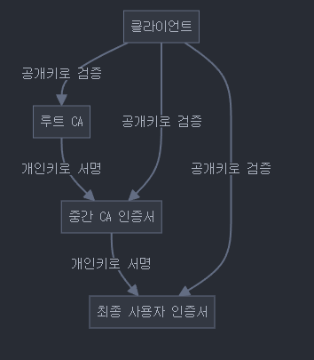
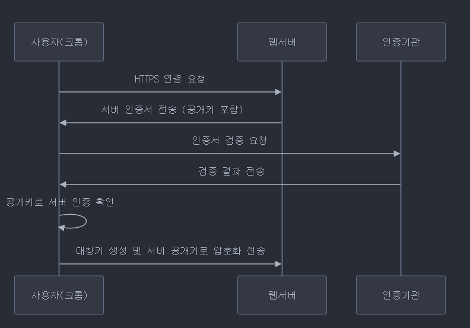
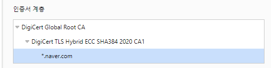

# 신뢰체인

## 개요

기업용 보안 인증서의 경우 다음의 요구사항을 충족해야한다.
1. 보안
2. 패킷이 반드시 목적지에 도달할 것을 보장
3. 낮은 전송 시간
4. 고 가용성 및 재해 방지
5. 수직, 수평적으로 높은 규모임

## 배경

인터넷에 접속하는데, 다른 사람은 이 key를 모르게 접속해야하며, 나와 인터넷만의 secure commicate가 가능해야합니다. (보안 소통)

특히, 온라인 사기 및 수 많은 인터넷 중 검증가능한 웹 사이트에 접속하기 위한 방법이 필요하고, 자신의 신원을 확실하게 하며, 대규모 인원에 대해 검증가능한 방법이 필요해졌기 떄문입니다.

신뢰 체인을 활용하면, 자신의 신원 및 검증가능한 인터넷을 확인할 수 있어, 어느정도의 보안을 바로 얻을 수 있습니다.

또한, 서로 간 연결을 공개키를 통해 암호화가 가능하기 때문에 해커가 패킷을 감청하더라도
암호화를 통해 데이터를 보호할 수 있습니다.

## 동작

1. (크롬 기준) 크롬을 설치하면 브라우저 내에 Root의 CA 공개키가 내장되어 있으며, 주기적으로 업데이트 된다(공개키 변화)
2. 임의의 주소에 접속하게 되면 다음의 과정을 거친다.
    1. 웹 서버는 자신의 공개키가 포함된 디지털 인증서를 클라이언트에게 전송한다.
    2. 인증서에는 서버의 도메인 이름, 공개키, 상위 인증기관(CA)의 정보가 포함됨
    3. 상위 인증기관으로 올라가 2번에서 획득한 공개키로 상위 인증기관에게 검증한다.
    4. 검증이 된 경우, 다시 디지털 인증서를 받을 수 있으며 2~3을 반복한다.
    5. 최종적으로 Root CA 인증서까지 도달한다.
    6. **RooT CA** 인증서는 브라우저 or 운영체제에 미리 설치되어 있으며 여기서 공개키를 얻어 최상위 인증서를 검증한다.
    7. 모든 과정을 거처 인증서가 유효하다고 판정하면 이제 믿을만한 웹 사이트가 된 것이다.
3. 브라우저는 임시 대칭키(공개 - 세션 키)를 생성한다.
4. 임시 대칭키는 브라우저의 공개키를 통해 암호화 된다. **(서버는 개인키가 있으니 복호화 가능)**
5. 서버는 복호화를 통해 임시 대칭키를 얻고, 이제 임시 대칭키를 통해 **암호화**된 소통을 시작한다.
6. 여기서 임시 대칭키를 사용하는 이유는, 공개키를 통해 바로 해제할 수 있어 공개키, 개인키 보다 훨씬 빠른 소통이 가능해지기 때문이다.

## 결론

이 신뢰 체인을 이용하여 검증된 웹사이트를 확인하고 사용자와 웹 사이트간 1대1 보안 통신을 진행할 수 있다.

또한 웹 사이트는 자신의 개인키를 보호하면서도, 사용자와의 1대1 암호화 통신을 진행할 수 있다.

## 추가

RooT CA가 되기 위해서는 전 세계적 협회에서 관리하고 있으며, 전세계적으로 인정받는 소수의 기관만이 Root CA로 운영되고 있다.

또한, 중간 CA는 RooT CA에서 관리하고 있으며
이를 통해 신뢰 체인이 형성된다.

그로 이 구조가 마치 체인을 닮았다고 하여 신뢰체인이라고 한다.