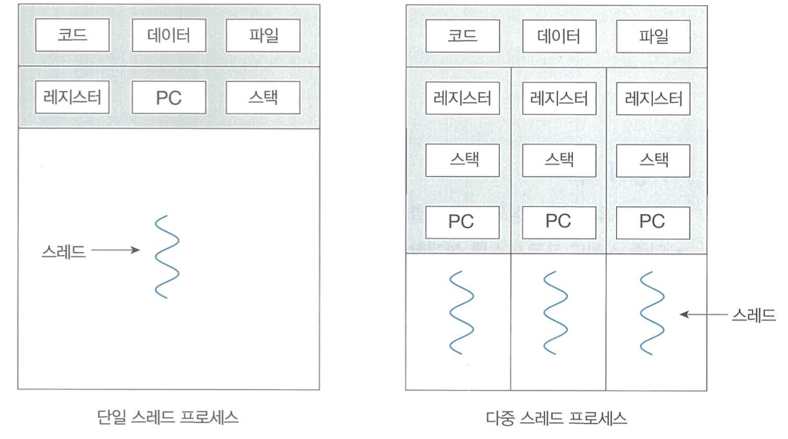

### 배경
- - -

스레드는 CPU 이용의 기본 단위이며 ID, PC(프로그램 카운터), 레지스터 집합, 스택으로 구성된다.

스레드는 **같은 프로세스**에 속한 다른 스레드와 코드, 데이터 섹션, 열린 파일, 신호 등
같은 운영체제 자원을 **공유**한다.

### 단일 스레드와 멀티 스레드의 구분
- - -

#### 장점(다중 스레드)
- - -

1. **응답성**: 응용 프로그램의 일부분이 봉쇄되거나, 하나의 작업을 수행하더라도 프로그램이 멈추지
않고 계속 작동하여 사용자에 대한 응답성을 증가시킨다.
2. **자원 공유**: 프로세스 생성을 위해 메모리와 자원을 할당하는 건 **비용**이 많이 든다.
스레드는 자신이 속한 프로세스의 자원들을 공유하여, 스레드를 생성하고 문맥교한 하는 것이 경제적이다.
그리고, 문맥 교환은 프로세스 사이 보다 스레드 사이에서 **더** 빠르다.