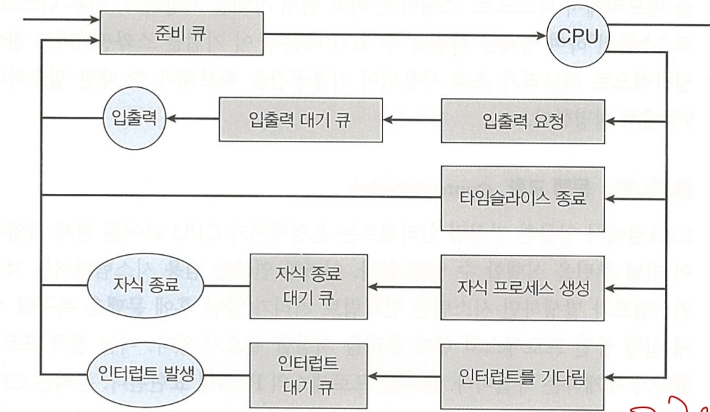
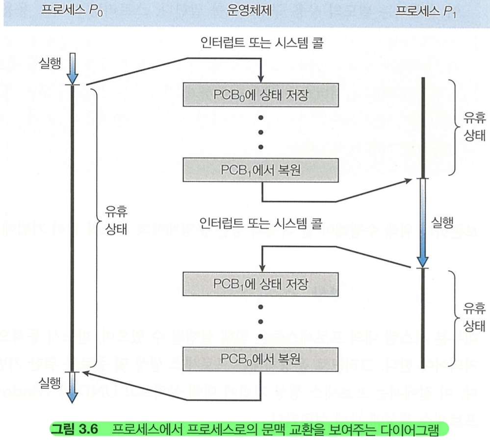

### 배경
- - -
다중 프로그래밍의 목적은 CPU 이용을 최대화 하기 위해 항상 프로세스가 실행되어 있는 것이다.

단, 사용자의 상호작용을 할 수 있도록 도중에 다른 프로세스를 계속 CPU에 교체한다.

이를 위해 프로세스 스케줄러는 실행 가능한 여러 프로세스 중 하나의 프로세스를 선택한다.

각 CPU 코어는 한 번에 하나의 프로세스를 실행할 수 있다. 단일 CPU는 한번에 2개 할 수 없지만,
다중 코어는 한번에 여러 프로세스를 실행할 수 있다.

코어보다 **많은** 프로세스가 있는 경우 초과된 프로세스는 코어가 다시 사용가능해지고,
스케줄 될 때까지 기다려야 한다.

### 스케줄링 큐
- - -

프로세스가 들어가면 **준비 큐**에 들어가서 실행되기를 기다린다. 큐는 일반적으로 연결리스트로 존재해
준비 큐의 헤더에는 첫 번째 PCB에 대한 포인터가 저장되고, 각 PCB에는 준비큐의 다음 PCB를 가르키는 포인터 필드가 있다.

다른 대기 큐도 존재하는데, 프로세스에 CPU 코어가 할당되면 프로세스는 잠시 동안 실행되고 결국
(1) 종료, (2) 인터럽트, (3)I/O 요청에 대한 완료 신호가 발생할 때까지 기다리게 된다.

(3)의 경우 장치는 일반적으로 프로세스보다 느리기 때문에 프로세스는 I/O완료 신호가 올 때까지 기다려야하며
이 프로세스는 대기 큐에서 기다리게 된다.

프로세스가 대기하게 되는 모습을 묘사한 큐잉 다이어그램을 보자

### 대기-준비 과정
- - -

1. 프로세스가 I/O 입력을 요청한 다음, 입력이 올 때까지 대기한다.
2. 새 자식 프로세스를 만든 다음, 자식의 종료까지 대기한다.
3. 인터럽트 또는 타임 슬라이스(활용 가능 시간)이 만료되 강제로 대기 큐로 간다.

프로세스는 종료될 때 까지 이 주기를 계속하며, 종류 시점에 모든 큐에서 제거되고 PCB 및 자원이 반환된다.

### 문맥 교환
- - -

인터럽트가 발생하면 시스템은 인터럽트 처리가 끝난 후에 이전 상황을 **복구** 할 수 있도록 현재 실행중인
프로세스의 정보(문맥)을 저장할 필요가 있다. 이는 프로세스를 중단했다가 재개할 수 있게 한다.

문맥은 프로세스의 PCB의 표현된다.

커널 모드 & 사용자 모드 둘 다 CPU의 현재 상태를 저장하고, 나중에 복구 작업을 수행한다.

따라서 CPU 코어를 다른 프로세스로 교환하면 이전 프로세스를 저장하고, 이제 실행하는 프로세스를 복구하는 
작업이 필요하다. 이를 **문맥 교환(context switch)**라고 한다.

문맥 교환이 진행될 동안 시스템은 아무런 일을 못하기 때문에 순수한 오버 헤드가 된다.
문맥 교환 시간은 하드웨어의 지원에 크게 좌우되며, 레지스터 정보로 부족한 경우 메모리에서 복사해야한다.

또한, 운영체제가 복잡할 수록 문맥 교환시 처리해야할 작업의 양이 더 많다.