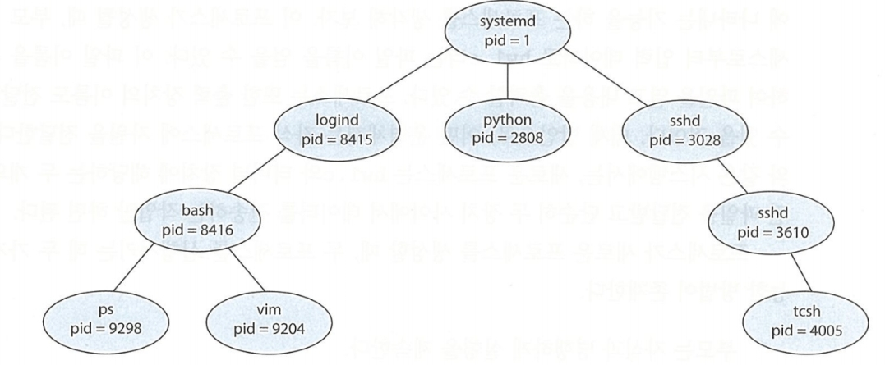
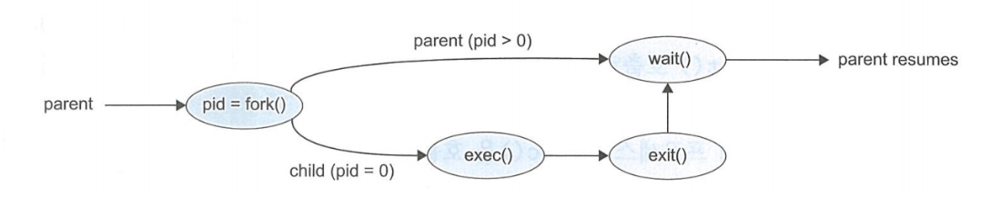
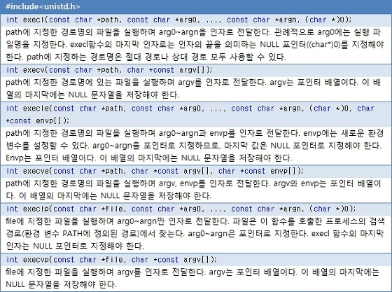

### 배경
- - -

실행되는 프로세스는 여러 개의 새로운 프로세스를 생성할 수 있다.
프로세스는 사용자의 요청으로는 생성할 수 없고, 운영체제의 **시스템 콜**을 통해서만 가능하다.

생성하는 프로세스는 **부모 프로세스**가 되고, 새로운 프로세스는 자식 프로세스라고 부른다.
이 자식 프로세스는 또 다른 프로세스를 생성할 수 있으며 결과적으로 **트리구조**가 형성되고
각자의 고유한 PID를 가지게 된다.

아래 사진은 프로세스가 트리구조로 생성된 모습을 보여준다. 그 중 언제나 Pid가 1인
systemd 프로세스는 모든 사용자 프로세스의 루트 부모 프로세스 역할을 수행한다.

<div align='center'>

</div>

### 생성
- - -

프로세스가 자식 프로세스를 생성할 때, 자식 프로세스는 자신의 목적을 위해 자원이 필요하다.
* 자원: CPU 시간, 메모리, 파일, 입출력 장치

자식 프로세스는 이 자원을 운영체제에서 직접 얻거나, 부모 프로세사가 가진 자원의 부분을 사용한다.
부모 프로세스는 자원을 분할해서 자식 프로세스에게 나누어 주거나, 메모리 - 파일 같은 자원은 자식과
같이 공유하여 사용할 수 도 있다. 부모 프로세스의 자원을 할당받아 사용한다면,
자식 프로세스를 많이 생성하여 시스템을 과부화 상태로 만드는 일을 방지할 수 있다.

부모 프로세스가 자식 프로세스를 생성할 때, 두 포르세스를 실행하는데 두 가지 방법이 존재한다.

1. 부모는 자식과 병행하게 실행을 계속한다.
2. 부모는 일부, 또는 모든 자식이 실행을 종료할 때 까지 기다린다.

또한, 새로운 프로세스들의 주소 공간으로 보면 다음 두 가지 변화가 있다.

1. 자식 프로세스는 부모 프로세스의 복사본이다. (똑같은 프로그램과 데이터를 가짐)
2. 자식 프로세스가 자신에게 적재될 새로운 프로그램을 가지고 있다.

먼저, 새로운 프로세스가 생성되기 위해서 **fork()** 시스템 콜로 요청하여 새로운 프로세스가 생성된다.
새로운 프로세스는 원래 프로세스의 주소 공간의 복사본으로 구성되어 있어, **쉽게** 자식 프로세스와
통신할 수 있다.

fork() 함수의 경우 자식과 부모의 반환값이 다른데 자식 프로세스의 반환값은 0이고 부모 프로세스의
반환값은 자식 프로세스의 **id**를 가진다.

부모는 더 많은 자식을 생성할 수 있고, 자식이 실행되는 동안 할 일이 없으면 자식이 종료될 때까지
준비 큐에서 자신을 등록하지 않기 위해 **wait()** 시스템 콜을 요청한다.

### 변화
- - -

만일, fork() 다음에 두 부모 자식 프로세스 중 한 프로세스가 **exec()** 시스템 콜을 사용한다면,
자신의 메모리 공간을 세로운 프로그램으로 교체한다. 

exec() 시스템 콜은 이전 파일을 메모리로 적재하고 그 프로그램의 실행을 시작한다.

이와 같은 방법으로 두 프로세스는 통신을 할 수 있으며, 그 후 각자의 길을 간다.

exec() 함수는 프로세스의 주소 공간을 새 프로그램으로 덮어쓰기 때문에, exec()는 오류가 아닌 이상
제어 값을 반환하지 않는다.

아래 사진은 fork() 시스템 콜을 통한 프로세스 생성을 한눈에 보여준다.

<div align='center'>

</div>

### 종료
- - -

프로세스가 마지막 실행을 끝내고, **exit()** 시스템 콜을 사용하여 운영체제에 자신의 삭제를 요청하면
종료한다. 이 시점에서, 프로세스는 자신을 기다리는 부모 프로세스에게 **상태 값**을 반환할 수 있다.
물리 메모리, 가상 메모리, 열린 파일, 입출력 버퍼를 포함한 모든 자원이 할당 해제 되고 운영체제로 반납된다.

이 방법 외에도, 한 프로세스가 시스템 콜을 사용해 **다른 프로세스 종료**를 **유발**할 수 있다.
통상적으로, 이런 시스템 콜은 단지 종료될 프로세스의 부모만이 호출할 수 있다.

만약 그렇지 않다면, 오작동 하는 다른 프로세스가 임의로 프로세스를 죽일 수 있을 것(kill)이다.

부모가 자식을 종료시키기 위해서는 자식의 Pid를 알아야한다. 그렇기 때문에, 자식 프로세스를 만들 때
**자식의 id**가 부모에게 전달된다.

다음과 같은 여러가지 이유에 의해 자식을 종료할 수 있다.

1. 자식이 자신에게 할당된 자원을 초과하여 사용할 때 (이때 부모는 자식을 점검할 수 있는 수단이 필요함)
2. 자식에게 할당된 작업이 더 이상 필요 없을 때
3. 부모가 exit를 하는데, 운영체제는 부모가 없는데 자식이 동작하는 걸 하용하지 않는 경우

몇몇 시스템에서는 부모가 종료하면 자식이 존재할 수 없다. 그런 시스템은 프로세스가 종료되면
그 프로세스로 비롯된 모든 자식 프로세스도 종료되어야 한다. 이를 **연쇄식 종료**라고 하며
이 작업은 운영체제가 시행한다.

프로세스가 종료하면 사용하던 자원은 운영체제가 가져간다. 프로세스의 종료 상태가 저장되는 프로세스 테이블의
해당 항목은 메모리 상에서 부모 프로세스가 wait()를 호출할 때까지 남아있게 된다. 종료되었지만, 부모프로세스가 아직 wait()
호출을 하지 않은 프로세스를 **좀비** 프로세스라고 한다. 

종료한 모든 프로세스는 좀비 상태가 되지만, 아주 짧은 시간만 좀비 상태가 되고, 부모가 wait를 호출하면
좀비 프로세스의 식별자와 프로세스 테이블이 모두 운영체제에 반환된다.

그런데, 부모 프로세스가 wait를 호출하는 대신, 종료한다면 이럴 때는 자식 프로세스가 반환되지 못한다.

이렇게 부모에게 버려진 자식 프로세스를 **고아** 프로세스라고 한다. 운영체제는 이 고아 프로세스를 해결하기 위해
새로운 프로세스로 init 프로세스를 지정하여 이 문제를 해결한다. (UNIX의 경우)

(init은 systemd처럼 root에 위치한다.) init 프로세스는 주기적으로 wait를 호출해 고아 프로세스를 종료하고 자원을 회수한다.
linux는 systemd 이외의 프로세스가 고아 프로세스를 상속하고 종료를 관리하도록 허용하고 있다.	

### 시스템 콜
- - - 

**Fork() 시스템 콜**

```cpp
int pid = fork();   

if (pid == 0) {
	printf("child");
} else if (pid > 0) {
	printf("parent");
}
```
fork를 실행하면 자식 프로세스가 생성되고, 똑같이 복사된 위 코드를 실행하지만 자식 프로그램은 CPU의 프로그램 카운터도 동일하게
복사하기 때문에, 코드의 진행상황도 똑같이 복사한다. 따라서 pid = fork() 이후의 코드부터 진행하게 된다.
부모는 양수 pid를 가지고 자식은 pid가 0이기 때문에 부모와 자식을 구분할 수 있다.

**Exec() 시스템 콜**

```cpp
int pid = fork();
if (pid == 0) {
	execlp("ls", "-a", 0);
} else if (pid > 0) {
	printf("parent");
}
```
exec를 실행하면 인자로 받은 함수 및 프로그램을 실행하게 된다. 따라서 기존 코드는 전부 사라지고
새로 설정한 프로그램으로 덮어 씌워 진다.

아래 사진은 exec에 대한 함수의 특징을 정리한 표이다.

<div align='center'>

</div>

**Wait() 시스템 콜**


```cpp
int pid = fork();
if (pid == 0) {
	//자식 이 실행되는 정의
} else if (pid > 0) {
	wait();
}
```

wait는 자식이 종료될 때까지 부모가 wait하는 경우에 사용한다. 이 경우 준비 큐에 들어가지 않고 대기 큐에서
부모 프로세스가 대기하게 된다.

fork로 분가하는 경우 부모, 자식이 실행되는 순서를 결정할 수 없기 때문에 pid를 통해 부모와 자식을 구분하여
처리한다.

자식 프로세스가 종료되먼 운영체제는 부모 프로세스를 대기 큐에서 준비 큐로 넣어 깨우게 된다.

**Exit() 시스템 콜**

```cpp
int pid = fork();
if (pid == 0){
	printf("Child");
	exit(0);
}
else {
	printf("Parent");
	exit(0);
}
```

exit는 작업의 종료를 알려주는 시스템 호출이고, exit를 통해 부모 프로세스는 자식이 사용하는 자원을 빠르게 회수
할 수 있다. 또한, exit가 전달하는 인자를 확인하면 자식이 정상, 비정상 종료했는지 구분할 수 있는데,

인자가 0이면 정상 종료이고 -1이면 비정상 종료이다.