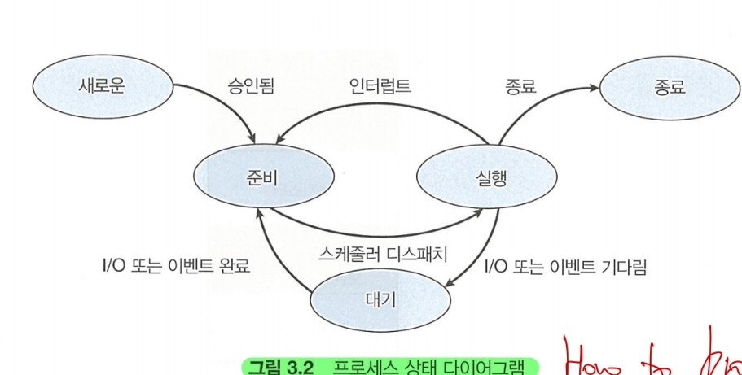
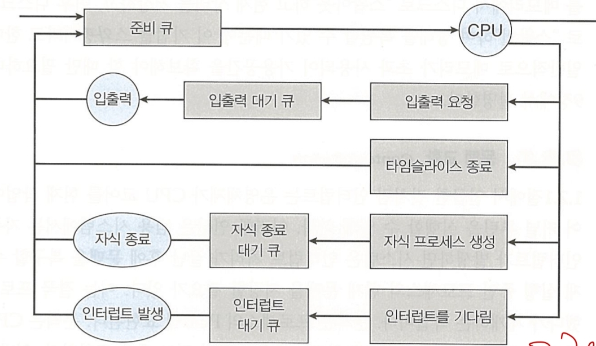

### 배경
다중 프로그래밍의 목적은 CPU 이용을 최대화 하기 위해 항상 프로세스가 실행되어 있는 것이다.

단, 사용자의 상호작용을 할 수 있도록 도중에 다른 프로세스를 계속 CPU에 교체한다.

이를 위해 프로세스 스케줄러는 실행 가능한 여러 프로세스 중 하나의 프로세스를 선택한다.

각 CPU 코어는 한 번에 하나의 프로세스를 실행할 수 있다. 단일 CPU는 한번에 2개 할 수 없지만,
다중 코어는 한번에 여러 프로세스를 실행할 수 있다.

코어보다 **많은** 프로세스가 있는 경우 초과된 프로세스는 코어가 다시 사용가능해지고,
스케줄 될 때까지 기다려야 한다.

- - -
### 스케줄링 큐

- - -
프로세스가 들어가면 **준비 큐**에 들어가서 실행되기를 기다린다. 큐는 일반적으로 연결리스트로 존재해
준비 큐의 헤더에는 첫 번째 PCB에 대한 포인터가 저장되고, 각 PCB에는 준비큐의 다음 PCB를 가르키는 포인터 필드가 있다.

다른 대기 큐도 존재하는데, 프로세스에 CPU 코어가 할당되면 프로세스는 잠시 동안 실행되고 결국
(1) 종료, (2) 인터럽트, (3)I/O 요청에 대한 완료 신호가 발생할 때까지 기다리게 된다.

(3)의 경우 장치는 일반적으로 프로세스보다 느리기 때문에 프로세스는 I/O완료 신호가 올 때까지 기다려야하며
이 프로세스는 대기 큐에서 기다리게 된다.

프로세스가 대기하게 되는 모습을 묘사한 큐잉 다이어그램을 보자

1. 프로세스가 I/O 입력을 요청한 다음, 입력이 올 때까지 대기한다.
2. 새 자식 프로세스를 만든 다음, 자식의 종료까지 대기한다.
3. 인터럽트 또는 타임 슬라이스(활용 가능 시간)이 만료되 강제로 대기 큐로 간다.

프로세스는 종료될 때 까지 이 주기를 계속하며, 종류 시점에 모든 큐에서 제거되고 PCB 및 자원이 반환된다.