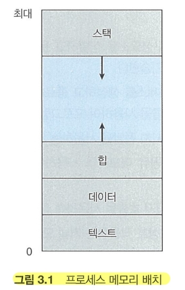
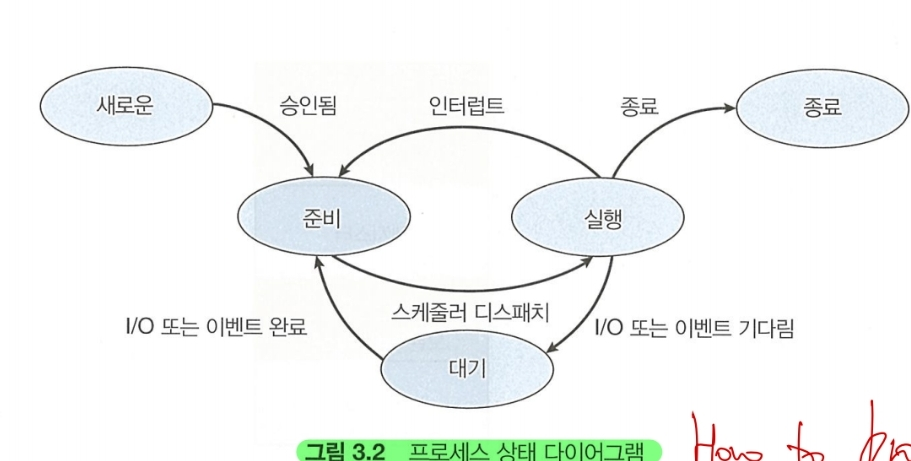
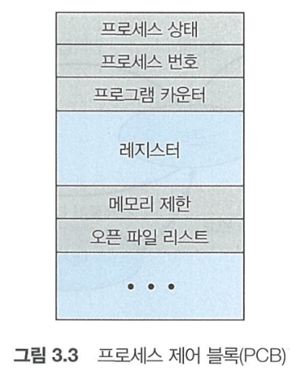

- - -
* 텍스트: 실행코드
* 데이터: 전역 변수
* 힙: 동적 메모리
* 스택: 함수 호출 데이터 저장 장소

1. 텍스트와 데이터는 변동하지 않음.
2. 힙과 스택은 동적으로 줄어들고 커질 수 있으니
3. 스택 및 힙이 겹치지 않도록 **운영체제** 가 조절해 줘야함.

- - -
* 어느 한 순간에 한 처리기 코어 에서는 오직 하나의 프로세스만이 실행 된다.

- - -
이러한 프로세스들은 프로세스 제어 블록(PCB)에 의해 표현됨

1. 프로세스 상태: 새로운, 준비, 실행, 대기, 정지를 표현함
2. 프로그램 카운터: 이 프로세스가 **다음에** 실행할 명령어의 주소를 가르킴
3. CPU 레지스터: 인터럽트가 발생하면 다른 프로세서가 실행되기 때문에 레지스터가 변경된다. 그렇기 때문에 레지스터 정보를 저장해 둬야 한다.
4. CPU-스케줄링 정보: 프로세스 우선순위, 스케줄 큐에 대한 정보를 저장한다.
5. 메모리 관리 정보: 페이지 테이블 및 세그먼트 테이블의 정보를 저장한다.
6. 회계정보: CPU 사용시간, 경과된 실시간, 시간제한, 프로세스 번호
7. 입출력 상태 정보: 이 프로세스에 할당된 입출력 장치, 열린 파일들의 목록 등

- - -
이러한 구조는 멀티스레드를 고려하지 않은 스레드 = 프로세서 구조인 단일 프로세스의 설명이다.
예로, 위드 프로그램을 사용할 때 단일 스레드라면 사용자가 문자를 입력하면서 워드가 자동 완성을 추천하거나, 철자를 검사하지 못한다.

그래서 대부분 현대 운영체제는 하나의 프로세스가 다수의 스레드를 가질 수 있게 하여 하나의 스레드가 사용자의 입력을 받는 동안
다른 스레드가 자동 완성 및 철자를 검사할 수 있는 것이다.

스레드를 지원하는 시스템에서 **PCB**도 확장되어 각 스레드에 대한 정보를 포함한다. 그로 인해 멀티 스레딩이 가능해지는 것이다.