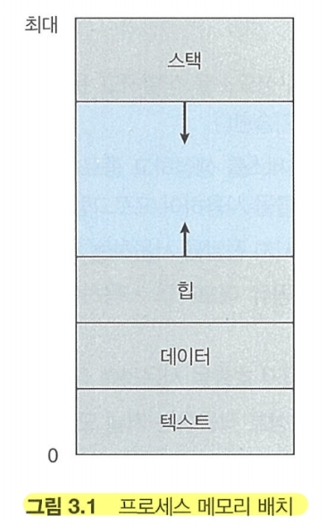
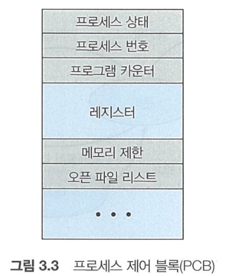

* 텍스트: 실행코드
* 데이터: 전역 변수
* 힙: 동적 메모리
* 스택: 함수 호출 데이터 저장 장소

1. 텍스트와 데이터는 변동하지 않음.
2. 힙과 스택은 동적으로 줄어들고 커질 수 있으니
3. 스택 및 힙이 겹치지 않도록 **운영체제** 가 조절해 줘야함.

* 어느 한 순간에 한 처리기 코어 에서는 오직 하나의 프로세스만이 실행 된다.

이러한 프로세스들은 프로세스 제어 블록(PCB)에 의해 표현됨

1. 프로세스 상태: 새로운, 준비, 실행, 대기, 정지를 표현함
